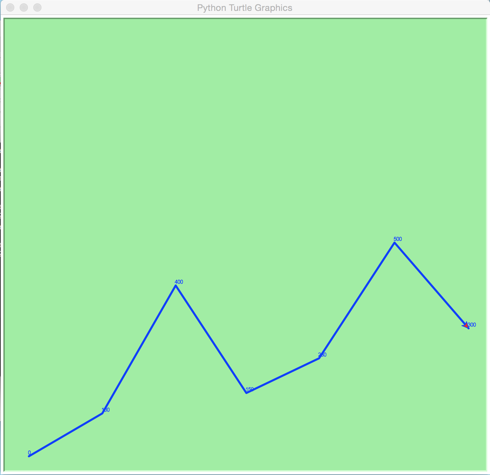

# python draw chart use turtle

PREVIEW
--------------------------

### bar chart 

### broken line chart

Usage
------------------
`python3 graph.py`

`select graph (0~1)[0:barchar],[1:graph of broken lines]: 0`
`input value ex) 100 200 300: `
`100 200 300 400`
